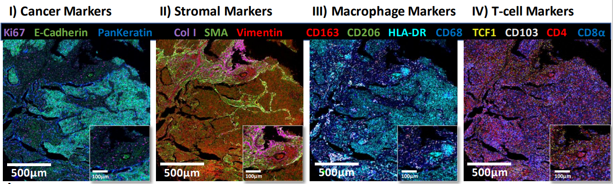
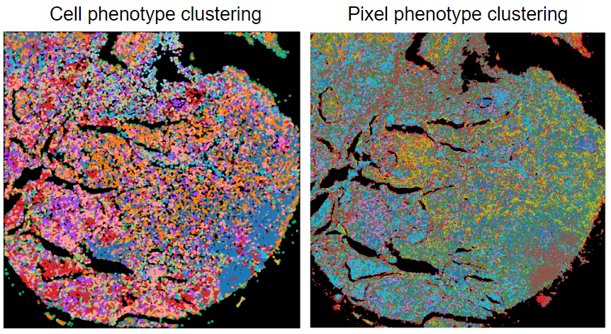
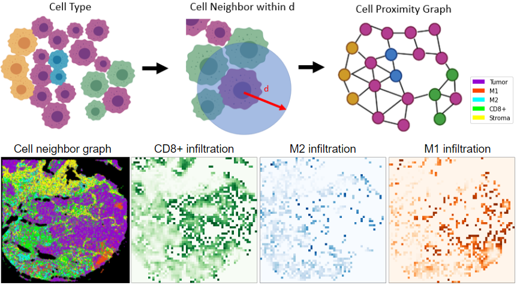

This folder contains the scripts and data to reproduce the result in the paper "Spatially variant immune infiltration scoring in human cancer tissues"

From IMC image dataset, we look at tumor microenvironment in Lung Tumor with cancer, stromal, macrophage and T-cell markers.

Single-cell and pixel level phenotype is analyzed via unsupervised clustering

Based on single-cell phenotype, we looked at immune cell infiltration in cancer region from cell neighborhood graph.

# Organization

## Notebooks 
"notebooks" folder contains jupyter notebook script used:
- 01_segmentation is the script for generating deep learning based single-cell segmentation from multiplex IMC images from cohort 2
- 02_cell_clustering is the scripts for generating cell clustering based on phenotype with umap embedding and spatial visualization of clustered cells cohort 2 
- 03_pixel_clustering is the scripts for generating pixel level clustering with umap embedding and spatial visualization
- 04_spatial_variant_score is the scripts for generating immuno score at cell (1), pixel (2) level, comparison of cell and pixel level (3) and correlation with all available markers (4)
- 05_new_data_process is the scripts for processing IMC images from cohor 1 with multiplex image visualization 
- 06_new_data_clustering is the scripts for generating cell level and pixel level clustering for IMC images from cohort 1
- 07_new_data_spatial_variant_score is the scripts for generating immunoscore for cohort 1 with M1 and M2 macrophage phenotypes
- 09_breast_HE is the scripts for processing breast cancer H&E images, single-cell level segmentation and classification, and calculating immune cell infiltration score 

- sup_diameter_study is the script used for generating single-cell nuclei diameter statistics and show how cell neighborhood radius was choosen
- sup_create_giotto__files is the script used for converting our data to giotto format for comparison of the two pipelines
- sup_stats_plot is the script used for generating heatmap plot of cohort 2 marker intensity 
- sup_create_HE_images is the script used for generating virtual H&E stain 

## Figures 
"figures" folder contains generated figures for the paper

